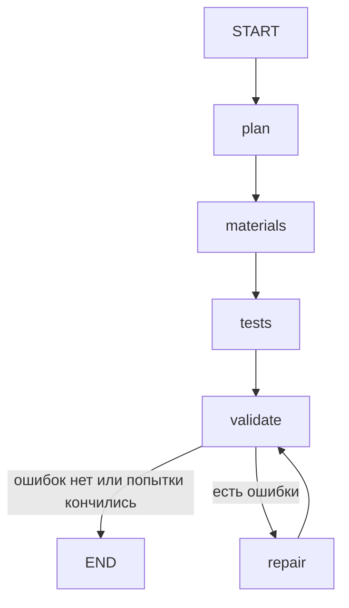

# AI Lab Trainer

ИИ-агент для преподавателя: по теме занятия («Создание агента с инструментами») и уровню
сложности генерирует лабораторную работу по агентной разработке — условие, инструкцию,
шаблон решения, эталонное решение, автотесты и критерии оценивания. Преподаватель
редактирует результат, после чего работа экспортируется в Moodle или Gitverse, а решения
студентов проверяются автоматически.

> Статус: каркас. Модель данных, формат хранения, проверка (grader), граф генерации на
> LangGraph и экспорт в папку для Gitverse работают; экспорт в Moodle пока заглушка.
> См. [Roadmap](#roadmap).

## Как это работает

```
 тема + уровень ─▶ generate ─▶ labs/<id>/ (draft) ─▶ преподаватель правит файлы
                                                         │
                                  validate ◀─────────────┘
                                     │  эталон проходит все тесты, шаблон — ни одного,
                                     │  автопроверка покрывает ≥ 80% требований
                                  approve
                                     │
                    ┌────────────────┴────────────────┐
              export moodle-xml                 export gitverse
         (CodeRunner, проверка в Moodle)   (репозиторий-шаблон + CI)
                                                      │
                                            grade ◀── решение студента
```

### Стек

| Часть | Выбор | Почему |
|---|---|---|
| Язык | Python 3.11+ | Основной язык курсов по агентам; тот же язык у студентов, тестов и инструмента |
| Оркестрация | LangGraph (`StateGraph`) | Этапы генерации — узлы графа, цикл «проверка → исправление» — условное ребро |
| LLM | LangChain chat models, `with_structured_output` | Ответ валидируется Pydantic-схемой; провайдер задаётся строкой: Claude по умолчанию, OpenAI или любой OpenAI-совместимый сервер (Ollama, vLLM) |
| Модель данных | Pydantic v2 | Одна схема для генерации, хранения, валидации и экспорта |
| Хранение | Папка на лабораторную: YAML + Markdown + код | Преподаватель правит в любом редакторе, изменения видны в git diff |
| Автопроверка | pytest + JUnit XML, маппинг тест → требование | Стандартный инструмент, работает и локально, и в CI, и в CodeRunner |
| Moodle | Импорт Moodle XML с вопросами CodeRunner; Web Services для оценок | Core Web Services не умеют создавать активности, а импорт вопросов работает на любом Moodle с CodeRunner |
| Gitverse | Репозиторий-шаблон + CI, публикация через `git push` | Не зависит от API: «корректный импорт» есть уже при локальном экспорте |
| CLI | Typer | `generate → validate → approve → export → grade` |

### Ключевое решение: тесты без настоящей LLM

Студенты пишут агентов, которые обращаются к LLM. Чтобы проверка была детерминированной и
бесплатной, каждая лабораторная поставляется с фикстурой `FakeLLM` в `tests/conftest.py`.
Это чат-модель LangChain (`BaseChatModel`): она возвращает заранее заданные `AIMessage` с
текстом или `tool_calls`, а тесты проверяют,
как код студента ведёт себя в ответ. API-ключ нужен только генератору заданий, не студентам и
не проверяющему.

## Модель лабораторной

`src/lab_trainer/models.py`:

- `LabAssignment`: `topic`, `difficulty`, `status` (draft → approved → published), `brief`,
  `instructions`, `learning_objectives`, `requirements`, `starter_files`, `solution_files`,
  `test_files`, `tests`, `rubric`.
- `Requirement` (`R1`, `R2`, …): проверяемое требование, `check: auto | manual`, ссылки на тесты.
- `AutoTest`: имя pytest-функции, какие требования проверяет, баллы, `hidden`.
- `RubricItem`: баллы и критерии оценки для требования.
- `auto_check_coverage`: доля требований с автопроверкой; валидатор требует ≥ 80%.

Уровни сложности (`Difficulty`):

| Уровень | Шаблон решения | Тесты |
|---|---|---|
| `basic` | Почти весь код дан, студент заполняет TODO | Все открыты |
| `intermediate` | Каркас и интерфейсы | Часть скрыта |
| `advanced` | Только контракт публичного API | Большая часть скрыта |

Формат на диске (`src/lab_trainer/storage.py`):

```
labs/<lab-id>/
  lab.yaml          метаданные, требования, индекс тестов, критерии
  brief.md          цель и контекст
  instructions.md   пошаговая инструкция
  starter/          что получает студент
  solution/         эталонное решение (только преподаватель)
  tests/            pytest-файлы, включая скрытые, и conftest.py с FakeLLM
```

Пример: [`labs/tool-agent-basic`](labs/tool-agent-basic) — цикл агента на LangChain (`@tool`,
`bind_tools`, `ToolMessage`) с инструментом-калькулятором,
6 требований, 5 из них проверяются автоматически (83%).

## Граф генерации

`src/lab_trainer/generation/graph.py` — `StateGraph` LangGraph. Каждый LLM-узел — это
`prompt | llm.with_structured_output(Schema)`, поэтому любой шаг можно перегенерировать
отдельно, а модель подменить без изменения кода.



1. **plan**: тема + уровень → название, цели, требования (`LabPlan`)
2. **materials**: план → условие, инструкция, шаблон и эталонное решение (`LabMaterials`)
3. **tests**: план + эталон → pytest-файлы, индекс тестов, критерии оценки (`LabSuite`)
4. **validate**: сборка `LabAssignment` и `validate_lab`: эталон проходит все тесты, шаблон —
   ни одного, автопроверка покрывает ≥ 80% требований
5. **repair**: ошибки и вывод pytest возвращаются модели, она присылает исправленные части
   (`RepairPatch`); до 3 попыток, после чего черновик сохраняется с перечнем ошибок

Модель выбирается строкой `провайдер:модель` (`--model` или `LAB_TRAINER_MODEL`):

| Модель | Что нужно |
|---|---|
| `anthropic:claude-opus-5-5` (по умолчанию) | `ANTHROPIC_API_KEY` |
| `openai:<модель>` | `OPENAI_API_KEY` |
| `openai:<модель>` на Ollama / vLLM / LM Studio | `LAB_TRAINER_BASE_URL=http://localhost:11434/v1` |

## Структура репозитория

```
src/lab_trainer/
  models.py              модель данных
  storage.py             сохранение/загрузка папки лабораторной
  cli.py                 команды generate / validate / approve / export / grade
  generation/
    graph.py             граф генерации LangGraph: узлы, схемы, цикл repair
    llm.py               выбор чат-модели LangChain по строке провайдер:модель
    prompts.py           ChatPromptTemplate для каждого узла
    validation.py        проверка покрытия и прогон эталона/шаблона
  grading/runner.py      запуск pytest, баллы по требованиям
  export/
    base.py              общий контракт; экспорт только после approve
    gitverse.py          репозиторий-шаблон для студентов
    moodle.py            Moodle XML (CodeRunner) и клиент Web Services (заглушки)
labs/                    каталог лабораторных
tests/                   тесты самого инструмента
```

## Запуск

```bash
python -m venv .venv && . .venv/bin/activate
pip install -e '.[dev]'
pytest                                                   # тесты инструмента
lab-trainer validate tool-agent-basic                    # покрытие и проверки
lab-trainer grade tool-agent-basic labs/tool-agent-basic/solution

lab-trainer generate "Создание агента с инструментами" --difficulty intermediate
lab-trainer generate "RAG-агент" --model openai:qwen3-coder   # с LAB_TRAINER_BASE_URL на Ollama
```

Для генерации нужен ключ выбранного провайдера (см. `.env.example`). Тесты генератора
используют скриптованную модель и ключа не требуют.

## Roadmap

Критерии приёмки проекта и их состояние:

- [ ] Не менее 5 лабораторных работ (есть 1 пример, написан вручную)
- [ ] Минимум 3 уровня сложности (частично: уровни есть в модели данных и промптах, лабораторные пока только basic)
- [ ] Задания создаются автоматически из темы (граф LangGraph со всеми шагами и циклом repair готов и покрыт тестами; нужен прогон на реальной модели)
- [x] Автопроверка ≥ 80% проверяемых требований (grader + валидатор покрытия; пример — 83%)
- [ ] Интеграция или импорт в Moodle или Gitverse (экспорт папки для Gitverse работает, CI и Moodle XML — нет)
- [x] Преподаватель редактирует задание перед публикацией (draft → правка файлов → validate → approve; экспорт draft запрещён)

Ближайшие шаги:

1. Прогнать граф на реальной модели по нескольким темам и доработать промпты.
2. Human-in-the-loop через `interrupt` LangGraph и чекпоинтер (правка плана до генерации кода).
3. CI-файл для Gitverse и выгрузка скрытых тестов при проверке.
4. Moodle XML для CodeRunner и проверка импорта на тестовом Moodle.
5. Изоляция проверки (контейнер без сети, лимиты CPU/памяти).
6. Сгенерировать и отревьюировать 5+ лабораторных на разных уровнях.
